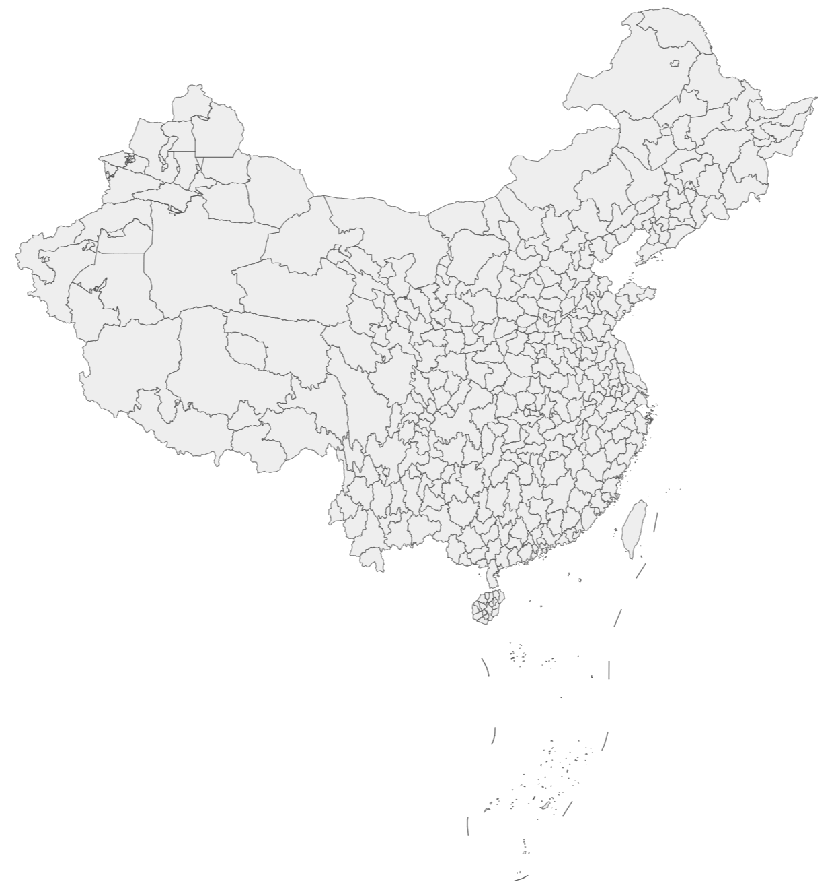

## 中国地级市/直辖市分割 geoJSON 格式地图数据  

**数据来源**：[阿里云atlas](http://datav.aliyun.com/tools/atlas/)  

批量下载脚本 `getMap.py` 阿里云atlas Geo json数据参考仓库：   
[https://github.com/lyhmyd1211/GeoMapData_CN/tree/V3](https://github.com/lyhmyd1211/GeoMapData_CN/tree/V3)  

`getMap.py` 脚本可自动批量下载全中国按省/自治区/直辖市分割的Geo json数据  
`china_city_proc.py` 脚本可自动处理从阿里云下载的按省/自治区/直辖市分割的json数据，合并为按照地级市/直辖市分割的全国地图json数据  
`china_city.json` 为已处理完成的，合并的中国地级市/直辖市分割 geoJSON 格式地图数据，可在echarts中直接调用  

>当前仓库数据下载于2024/8/30, 阿里云 Atlas显示更新于2021/5

## 分割效果参考图  
